# 🚀 Evershop E-commerce app:
A production-ready CI/CD pipeline that automates infrastructure provisioning, application deployment, and monitoring on AWS EKS using industry-standard DevOps tools.

---

## 📋 Table of Contents

- [Architecture](#-architecture)
- [Tech Stack](#-tech-stack)
- [Project Structure](#-project-structure)
- [Prerequisites](#-prerequisites)
- [Pipeline Overview](#-pipeline-overview)
- [Setup Instructions](#-setup-instructions)
- [Pipeline Execution](#-pipeline-execution)
- [Monitoring](#-monitoring)
- [Screenshots](#-screenshots)
- [Troubleshooting](#-troubleshooting)

---

## 🏗️ Architecture


*Complete CI/CD architecture showing Jenkins pipelines, AWS EKS cluster, ArgoCD GitOps, and monitoring stack*

---

## 🛠️ Tech Stack

| Category | Tools |
|----------|-------|
| **CI/CD** | Jenkins, ArgoCD |
| **Infrastructure** | Terraform, AWS EKS |
| **Container** | Docker, Kubernetes |
| **Code Quality** | SonarQube, Trivy |
| **Monitoring** | Prometheus, Grafana |
| **Version Control** | Git, GitHub |
| **Languages** | TypeScript (64.6%), HCL (31.0%), JavaScript (3.6%) |

---

## 📁 Project Structure

```
.
├── config/                    # Application configuration
├── extensions/sample/         # Sample extensions
├── iac/                       # Infrastructure as Code (Terraform)
├── k8s/                       # Kubernetes manifests
│   ├── deployment.yml         # Application deployment
│   ├── service.yml            # Service configuration
│   ├── statefulset.yml        # Database statefulset
│   ├── hpa.yml                # Horizontal Pod Autoscaler
│   └── vpa.yml                # Vertical Pod Autoscaler
├── themes/sample/             # Application themes
├── Dockerfile                 # Container image definition
├── Jenkinsfile                # Main application pipeline
├── Jenkinsfile-infra          # Infrastructure pipeline
├── package.json               # Node.js dependencies
└── README.md                  # This file
```

---

## ✅ Prerequisites

- AWS Account with appropriate permissions
- Jenkins server (with required plugins)
- GitHub account and personal access token
- Docker Hub account
- SonarQube server
- Tools installed:
  - Terraform >= 1.0
  - kubectl
  - helm
  - aws-cli
  - trivy

---

## 🔄 Pipeline Overview

### **Infrastructure Pipeline** (`Jenkinsfile-infra`)

Provisions complete AWS networking and EKS cluster infrastructure.

**Parameters:**
- `init` - Initialize Terraform
- `validate` - Validate Terraform configuration
- `plan` - Generate execution plan
- `apply` - Create infrastructure
- `destroy` - Tear down infrastructure

**Resources Created:**
- VPC with public/private subnets
- Internet Gateway & NAT Gateway
- EKS Cluster with managed node groups
- Security groups and IAM roles
- Network load balancers


---

### **Application Pipeline** (`Jenkinsfile`)

End-to-end CI/CD pipeline for application deployment.

**Parameter:**
- `VERSION` - Build version (used as Docker image tag)

**Pipeline Stages:**

```mermaid
graph LR
    A[Git Checkout] --> B[npm install]
    B --> C[npm test]
    C --> D[npm build]
    D --> E[SonarQube Scan]
    E --> F[Quality Gate]
    F --> G[Trivy FS Scan]
    G --> H[Docker Build]
    H --> I[Docker Push]
    I --> J[Trivy Image Scan]
    J --> K[Update Manifests]
    K --> L[Push to GitOps Repo]
    L --> M[Deploy Helm Charts]
    M --> N[ArgoCD Sync]
```



#### **Stage Details:**

1. **Code Checkout** - Fetch latest code from repository
2. **Install Dependencies** - `npm install`
3. **Run Tests** - `npm test`
4. **Build Application** - `npm build`
5. **SonarQube Analysis** - Code quality & security scan
6. **Quality Gate** - Enforce quality standards
7. **Trivy Filesystem Scan** - Scan source code for vulnerabilities
8. **Docker Build** - Create container image with VERSION tag
9. **Docker Push** - Push to Docker Hub/GitHub Container Registry
10. **Trivy Image Scan** - Scan Docker image for vulnerabilities
11. **Update Manifests** - Update k8s manifests with new image tag using `sed`
12. **Push Manifests** - Commit and push updated manifests to GitOps repo
13. **Install Tools** - Deploy ArgoCD, Prometheus, Grafana via Helm
14. **ArgoCD Deploy** - Automatic sync and deployment to EKS


---

## 🚀 Setup Instructions

### **1. Configure AWS Credentials**

```bash
aws configure
# Enter AWS Access Key ID
# Enter AWS Secret Access Key
# Default region: ap-south-1
```

### **2. Setup Jenkins**

Install required plugins:
- Pipeline
- Git
- Docker Pipeline
- SonarQube Scanner
- Kubernetes CLI

Configure credentials:
- AWS credentials
- GitHub token
- Docker Hub credentials
- SonarQube token

### **3. Setup SonarQube**

```bash
# Create project in SonarQube
# Generate authentication token
# Configure webhook: <JENKINS_URL>/sonarqube-webhook/
```

### **4. Configure Jenkins Jobs**

**Infrastructure Pipeline:**
```groovy
Pipeline from SCM > Git
Script Path: Jenkinsfile-infra
Parameters: init, validate, plan, apply, destroy
```

**Application Pipeline:**
```groovy
Pipeline from SCM > Git
Script Path: Jenkinsfile
Parameters: VERSION (string)
```

### **5. Setup ArgoCD**

```bash
# install ArgoCD via helm
# Access UI: kubectl port-forward svc/argocd-server -n argocd 8080:443
# Get password: kubectl -n argocd get secret argocd-initial-admin-secret -o jsonpath="{.data.password}" | base64 -d
```

---

## ▶️ Pipeline Execution

### **Step 1: Provision Infrastructure**

```bash
# Run Infrastructure Pipeline
1. Select: init, validate, plan, apply
2. Review Terraform plan
3. Apply to create EKS cluster (~15-20 mins)
```

### **Step 2: Deploy Application**

```bash
# Run Application Pipeline
1. Enter VERSION parameter (e.g., v1.0.0)
2. Pipeline will:
   - Build and test application
   - Scan code with SonarQube & Trivy
   - Build and push Docker image
   - Update k8s manifests
   - Deploy via ArgoCD
```

### **Step 3: Verify Deployment**

```bash
# Check pods
kubectl get pods -n <namespace>

# Check services
kubectl get svc -n <namespace>

# Check ArgoCD application
kubectl get applications -n argocd
```

---

## 📊 Monitoring

### **Prometheus**

- **Purpose**: Metrics collection and alerting
- **Access**: `kubectl port-forward -n monitoring svc/prometheus-server 9090:80`
- **Scrapes**: Kubernetes metrics, application metrics, node metrics

### **Grafana**

- **Purpose**: Visualization and dashboards
- **Access**: `kubectl port-forward -n monitoring svc/grafana 3000:80`
- **Default Credentials**: admin/admin (change on first login)
- **Dashboards**: Kubernetes cluster, application performance, resource utilization


---

## 📸 Screenshots

### SonarQube Analysis


*Code quality metrics, security vulnerabilities, and technical debt*

---

### ArgoCD Application Tree


*GitOps deployment status and resource hierarchy*

---

### Kubernetes Resources

```
Application
├── Deployment (app)
│   ├── ReplicaSet
│   └── Pods (3 replicas)
├── Service (LoadBalancer)
├── HPA (Horizontal Pod Autoscaler)
├── StatefulSet (database)
│   └── Pods (1 replica)
└── VPA (Vertical Pod Autoscaler)
```

---

## 🐛 Troubleshooting

### Pipeline Failures

**SonarQube Quality Gate Failed:**
```bash
# Check SonarQube dashboard for issues
# Fix code quality/security issues
# Re-run pipeline
```

**Docker Build Failed:**
```bash
# Verify Dockerfile syntax
# Check Docker daemon is running
# Verify registry credentials
```

**ArgoCD Sync Failed:**
```bash
# Check ArgoCD application logs
kubectl logs -n argocd deployment/argocd-application-controller

# Force sync
argocd app sync <app-name> --force
```

### Infrastructure Issues

**EKS Cluster Creation Failed:**
```bash
# Check AWS service limits
# Verify IAM permissions
# Review Terraform logs
terraform plan -out=plan.out
```

**Pods in CrashLoopBackOff:**
```bash
# Check pod logs
kubectl logs <pod-name> -n <namespace>

# Describe pod for events
kubectl describe pod <pod-name> -n <namespace>
```
